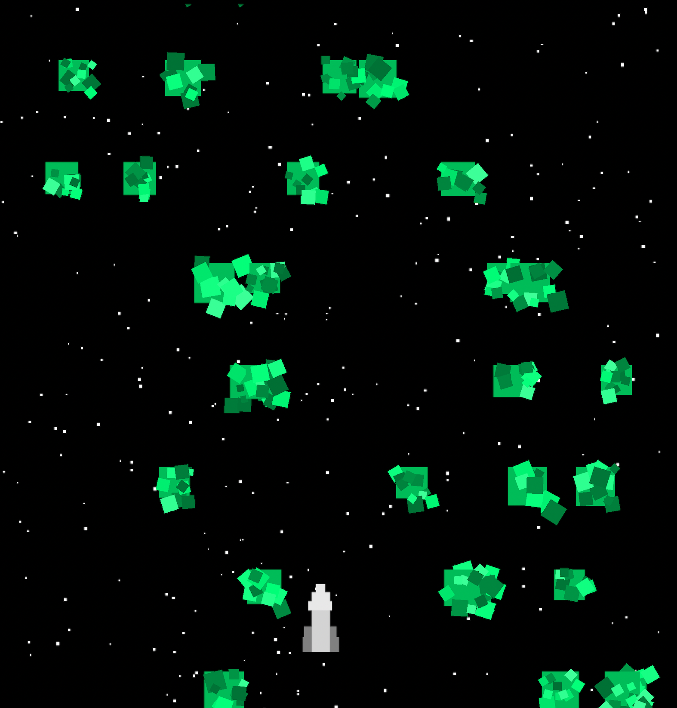
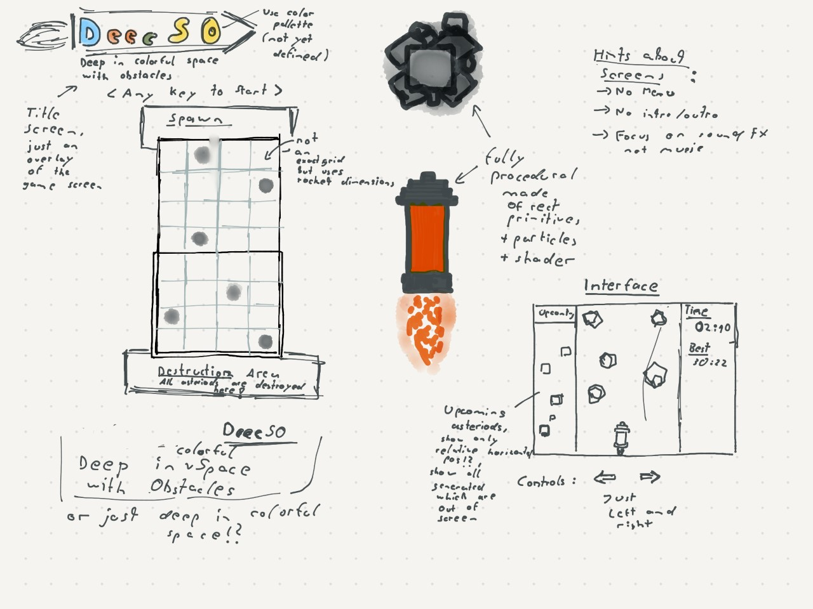

# Deep in colorful Space

This repository contains the sources of my game for Ludum Dare 51.
The topic was 'Every 10 Seconds', my game is about a space ship somewhere in deep space
that has to find its way through a lot obstacles. Every 10 seconds it gets more difficult - How far can you go?

## Development

Used Tools/Frameworks/Technologies:

- Qt 6.3/4 
- Clayground
- Audacity
- Inkscape
